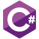

<h2 align="center">Hi 👋, I'm Juan</h2>
<h3 align="center">A passionate Frontend Developer from Cádiz, Spain.</h3>

Welcome to my GitHub profile! I have a year of experience working as Frontend Dev, currently expanding my horizons into the realm of game development with Unity and C#. I'm a technology enthusiast who's always eager to learn and explore new tools and frameworks.

### 💼 I'm currently working on:
- I’m currently attending a master's program in **Game Development with Unity and C#**

### 🌱 What I'm currently learning:
- Master's in Game Development with Unity and C#
- React
- Node.js
- Docker
  
And more on the horizon!

### 📫 How to reach me:

  
  

### Languages and Tools:

  
  
  
  
  
  
  
  
  
  

### 🎮 Fun fact:
- When I'm not coding, I'm probably gaming or brainstorming my next game idea!

---

Thank you for visiting my profile! I'm always looking to collaborate on interesting projects and learn from the community. Let's code something amazing together!
